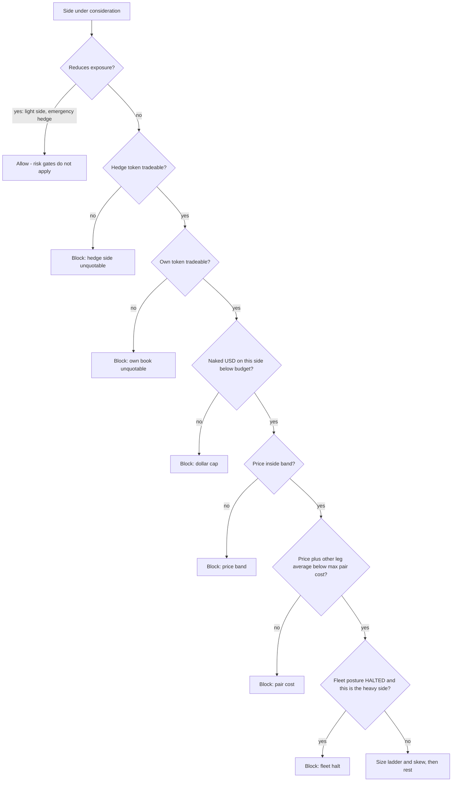
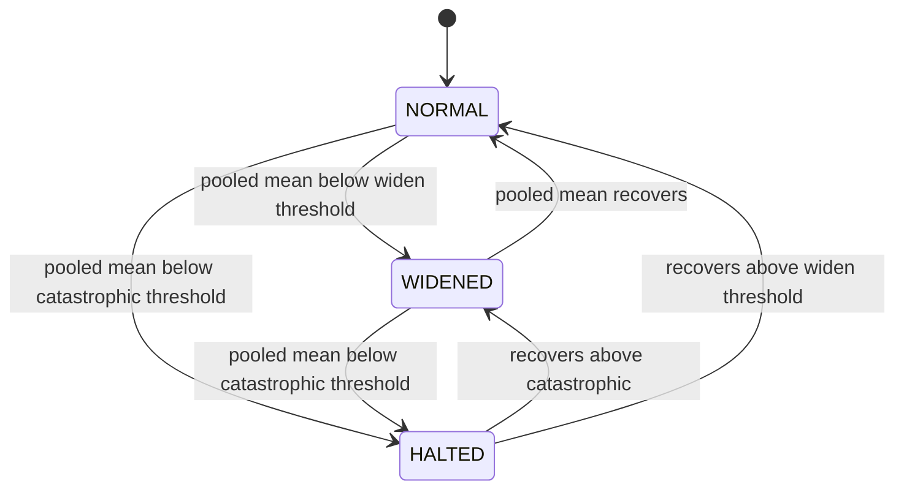

# Dollar-Denominated Risk Gates for the Spread Hunter Fleet - Plan

## Goal Capsule

- **Objective:** Bound the naked leg in dollars, refuse quotes whose hedge is untradeable, and give the fleet a circuit breaker. Execution and spread capture are already profitable and stay untouched.
- **Authority hierarchy:** This plan > repo conventions in `AGENTS.md` > existing code comments. Where a comment in `strategy/quotes.py` documents a rule this plan replaces, rewrite the comment; do not leave both rules described.
- **Execution profile:** Sequential. `U1` is a pure module with no callers and lands first. `U2`-`U4` change quoting behavior and each invalidates the running sample. `U5`-`U6` change measurement. `U7` proves the whole set against recorded data.
- **Stop conditions:** Stop and surface if replay (`U7`) shows the gates would have blocked more than half of the fills that produced the +$116.33 realized P&L. That would mean the gates are cutting profitable flow, not toxic flow, and the thresholds need rework before any of this runs live.
- **Tail ownership:** Every commit touching `strategy/` must update the four `research/` files in the same commit. A pre-commit hook enforces this.

---

## Product Contract

### Summary

Replace the fleet's share-denominated inventory limits with a dollar-denominated risk layer: a hard block on adding to an over-budget naked leg, a tradability test on the hedge side before any bid rests, a continuous size taper in place of the current cliff-edge cap, and price-dependent risk treatment. Wire the price-band and pair-cost rules — which exist in config but are unreachable on the live `rewards` path — into the path the fleet runs. Add size-weighted markout and a fleet-level halt so pooled evidence produces a proportionate response.

### Problem Frame

On 2026-08-05 the fleet held +$116.33 of realized P&L against -$223.32 of unhedged float. 85% of the unhedged loss sat in one market, `lol-maz-mg1`: 233.40 UP shares at an average of 0.8152, costing $190.26, accumulated in two fill events, in a book that later became unreadable on both sides.

Three limits were armed and none of them bound. `max_fills_per_market` counts fill events, and 233 shares arrived in two of them. `max_naked_shares` is 360 and the position stopped at 233. `skew_full_shares` is 240, so the price skew was still ramping when the position was already fully built.

The root cause is a unit mismatch. On a binary market the downside of one long share is the price paid for it. A 360-share cap permits $72 of risk at 0.20 and $293 at 0.8152 — it is loosest exactly where a wrong resolution costs most. Every per-market limit in `strategy/config.py` is share-denominated; only the fleet-level caps are in dollars.

Two rules that would have refused those fills are present in the codebase but never execute. `_in_band()` and the `max_pair_cost` check live in the legacy branch of `decide_quotes`, below the point where `_decide_quotes_rewards` returns. The live objective is `rewards`. The telemetry confirms both are inert: fills averaged 0.8152 against a nominal 0.30-0.70 band, and `wta-kalinsk-kessler` shows 14 pairs bought for $14.28 — $1.0200 per pair against a $0.995 cap, on an instrument that pays exactly $1.00.

Measurement has the same shape of defect. `_stats_from_rows` takes an unweighted mean, so the two prints that carried 233 shares voted with the weight of two 50-share prints. Because no market reaches `markout_min_sample`, every one of the 23 live markets inherits the same pooled reading of -0.052375 per share on n=52. That reading is 2.6 times `markout_catastrophic_threshold`, and the fleet's entire response is to widen quotes by 1.5c.

### Requirements

**Risk gating**

- R1. The binding per-market inventory limit is denominated in dollars at risk, computed as unhedged shares valued at the average cost of the naked leg.
- R2. No new bid rests on a side whose naked exposure already meets or exceeds the dollar budget.
- R3. No new bid rests on either side unless the opposite token is currently tradeable, because the opposite token is the only instrument that hedges the position a fill would create.
- R4. Risk gates apply to orders that add exposure. They never block an order that reduces exposure — the light side, the emergency hedge, merge, or an early exit.

**Quote shaping**

- R5. Resting size on the naked side decays continuously as dollar utilization rises, and reaches zero at the budget rather than stepping from full size to none.
- R6. Quote offset and quote size both respond to the price of the fill. Variance treatment peaks near 0.50; magnitude treatment rises with the price paid.
- R7. The price band and the pair-cost cap apply on the `rewards` objective, which is the objective the fleet runs.

**Measurement and fleet governance**

- R8. Markout aggregation weights each fill by its size, and reports an effective sample size so existing thresholds keep the meaning they were tuned with.
- R9. A pooled markout past the catastrophic threshold halts new naked exposure across the whole fleet.
- R10. The fleet halt is distinct from the per-market `EXITED` state. It is reversible, it is not a judgement about any individual market, and it never blocks the orders that flatten a position.

**Validation and operations**

- R11. The gates are proven by replay against the fills and markouts already recorded in `hunter.db` before they run live.
- R12. Replay reports how much of the recorded realized P&L the gates would have prevented, alongside how much of the unhedged loss they would have prevented.
- R13. Every commit touching `strategy/` updates the four `research/` files in the same commit.

### Acceptance Examples

- AE1. **Covers R2, R5.** Given a market holding 140 naked UP shares at an average of 0.82 ($114.80 at risk) against a $120 budget, when the fleet decides quotes, then the UP side rests no order and the DOWN side rests full size.
- AE2. **Covers R3.** Given a market with a two-sided UP book and a DOWN book quoting 0.999 bid with no ask, when the fleet decides quotes, then neither side rests an order and the blocked reason names the DOWN book.
- AE3. **Covers R4.** Given the same untradeable-hedge market while holding a naked leg large enough to trigger the emergency stop-loss, when the fleet decides quotes, then the crossing hedge intent is still produced.
- AE4. **Covers R7.** Given a market quoting 0.95/0.96 on UP under `objective="rewards"`, when the fleet decides quotes, then UP rests no order and the blocked reason names the price band.
- AE5. **Covers R8.** Given ten matured markout rows where one 200-share fill drifted -5c and nine 10-share fills drifted +1c, when per-market stats are computed, then the mean is negative and the effective sample size is below 3.
- AE6. **Covers R9, R10.** Given a pooled markout of -0.052 on a sufficient sample, when any market is visited, then the heavy side is blocked fleet-wide and the light side still rests.

### Scope Boundaries

- The allocator (`strategy/allocate.py`), the merge path (`strategy/merge.py`), profit-taking (`strategy/profit_take.py`), and reward-score optimization are unchanged.
- Where the position is flat and both books are healthy, quote placement is unchanged. This plan does not retune `reward_offset`.
- The per-market `EXITED` state and its evidence rules are unchanged. `U6` adds a fleet-level posture beside it, not a replacement for it.

#### Deferred to Follow-Up Work

- Replacing the fill-count cap `max_fills_per_market` with a notional cap. The dollar budget makes the fill counter redundant rather than wrong; removing it is a separate cleanup.
- Time-to-resolution gating. `min_t_remaining_sec` is inert because `strategy/fleet.py:1000` passes `t_remaining=1e9`. The `decided_price` check in U1 covers the observed failure — a market at 0.999/0.001 — without needing a resolution clock.
- Exit-liquidity forecasting: predicting that a book will become unreadable before it does.

#### Outside this product's identity

- Taking directional views. Every gate here reduces or refuses exposure; none opens a position on a forecast.
- Placing real orders. The repo is paper simulation only.

---

## Planning Contract

### Key Technical Decisions

- KTD1. **Dollar cap replaces the share cap; both units do not coexist.** `max_naked_usd` becomes the binding per-market constraint and `max_naked_shares` is removed from the quoting path. Two caps in different units means the looser one silently governs, which is the failure already observed — the share cap was nominally armed at 360 while the dollar exposure ran to $190. Default `max_naked_usd: 120.0`. Inside the 0.30-0.70 band that binds between 171 shares (at 0.70) and 400 shares (at 0.30), and it would have stopped `lol-maz-mg1` at roughly 147 shares instead of 233.

- KTD2. **The hedge side's health gates the quote, including on a flat market.** A bid is safe only if the position it might create can be closed, and on a binary market it is closed by buying the other token. This forfeits reward score on one-sided books rather than reacting after inventory exists. The alternative — gate only once inventory is held — fails on the observed case, where the position was built in two prints before the book degraded.

- KTD3. **When the offset budget is exhausted, express the remaining risk aversion as size.** Risk-driven widening competes with a fixed 4.5c reward window: under `WIDENED` the base offset is already 0.035, so a 0.015 skew plus band widening clamps at `max_spread_from_mid` and the risk response disappears. Rather than re-tuning `widen_offset`, compute the desired offset, clamp it to the window, and convert the clamped remainder into a size reduction. Risk aversion then always has somewhere to go.

- KTD4. **Effective sample size accompanies the weighted mean.** Once rows are weighted, a raw row count no longer describes how much evidence the mean rests on: ten fills where one carries 90% of the size is roughly one observation. Kish's `sum(w)^2 / sum(w^2)` equals the row count exactly when sizes are equal, so `markout_min_sample` and the doubling rule in `gate.next_state` keep their tuned meaning without being re-derived.

- KTD5. **The fleet halt is a new posture, not a new terminal state.** `_gate_with_fleet_fallback` already caps borrowed verdicts at `WIDENED` so pooled evidence cannot blacklist an unmeasured market, and that reasoning holds. But pooled evidence is valid for a reversible fleet-wide throttle. `HALTED` blocks additions to the heavy side everywhere while leaving the light side, merge, and exits open, and it clears when the pooled reading recovers.

- KTD6. **Risk gating lives in a new `strategy/risk.py`, not inside `strategy/quotes.py`.** The gates are pure functions over inventory and book dictionaries. `_decide_quotes_rewards` is already a 250-line function carrying six caps; adding five more inline makes the binding constraint unreadable. A separate module also lets replay (U7) call the gates directly without constructing a quoting cycle.

### High-Level Technical Design

Pre-quote gate order. Each gate is evaluated per side, and the first failure names the binding constraint in the blocked reason — an operator reading "not adding" must be able to tell which limit bound.

Fleet posture is derived per cycle from the pooled markout and is independent of any market's own gate state.

Book health is a three-part test on one token: two-sided, not settled, and neither too wide nor too thin. The settled test refuses the observed 0.999-bid / 0.001-ask book, which has no spread to capture and a naked leg already decided against us.

### Assumptions

- Replay against `hunter.db` is representative enough to size the thresholds. The database holds 57 fills across 23 markets over a 40.9-hour span, which is a small sample for threshold tuning even though it is adequate for demonstrating that a gate fires.
- The `bids` and `asks` dictionaries on the book carry enough depth to compute a meaningful sum. `tests/test_quotes.py` builds them as `{price: size}` and `strategy/fleet.py` passes real venue depth to `QueueFillEngine.cross`, so the shape is confirmed; the sufficiency of one aggregated number as a depth proxy is the assumption.

---

## Implementation Units

### U1. Risk primitives module

- **Goal:** A pure module exposing dollar-denominated exposure, risk utilization, and book health, with no callers yet.
- **Requirements:** R1, R3
- **Dependencies:** none
- **Files:**
  - `strategy/risk.py` (create)
  - `strategy/config.py` (modify)
  - `tests/test_risk.py` (create)
- **Approach:**
  1. Define `naked_side(inv)`, returning the heavier side or `None` when flat or balanced.
  2. Define `naked_usd(inv, side)` as excess shares times `inv.avg(side)`. Use average cost, not the current mark — this is the amount that goes to zero on an adverse resolution and it must not shrink because the mid already moved against us.
  3. Define `risk_utilization(cfg, inv, side)` as `naked_usd / cfg.max_naked_usd`, clamped to `[0.0, 1.0]`.
  4. Define `book_health(book, cfg)` returning a result carrying `ok` and a reason string. Three rejections: no two-sided quote; settled (`best_bid <= cfg.decided_price` or `best_ask >= 1 - cfg.decided_price`); too wide (`best_ask - best_bid > cfg.max_book_spread`) or too thin (summed `bids` depth below `cfg.min_book_depth_sh`).
  5. Add the new config fields with the measured-evidence comment style the surrounding fields use.
- **Patterns to follow:** `strategy/gate.py` — a small pure module with no I/O, consumed by the quoting layer. Config field comments follow the style already used on `max_naked_shares` and `max_committed_usd`.
- **Test scenarios:**
  - `naked_usd` returns 0 for a balanced inventory and for the light side of a lopsided one.
  - `naked_usd` on 233.4 UP shares and 0 DOWN at an average of 0.8152 returns 190.26 within a cent, reproducing the observed loss.
  - `naked_usd` values the excess at average cost: 200 UP against 100 DOWN at a 0.60 UP average returns 60.00, not 120.00.
  - `risk_utilization` clamps to 1.0 when exposure exceeds the budget, and returns 0.0 when `max_naked_usd` is 0.
  - `book_health` rejects a book with `best_ask` of `None`, and the reason names the one-sided condition.
  - `book_health` rejects a 0.999 bid / 0.001 ask book as settled — the exact shape recorded on `wta-kalinsk-kessler`.
  - `book_health` rejects a 0.26/0.42 book as too wide.
  - `book_health` rejects a book whose summed bid depth is below `min_book_depth_sh`.
  - `book_health` accepts a 0.52/0.53 book with 500 shares of depth.
- **Verification:** `tests/test_risk.py` passes and no other test changes behavior, because nothing imports the module yet.

### U2. Hard position block and hedge-side gate

- **Goal:** `_decide_quotes_rewards` refuses to add to an over-budget naked leg, and refuses any bid whose hedge token is untradeable.
- **Requirements:** R2, R3, R4
- **Dependencies:** U1
- **Files:**
  - `strategy/risk.py` (modify — add `hard_block`)
  - `strategy/quotes.py` (modify)
  - `strategy/config.py` (modify)
  - `tests/test_risk.py` (modify)
  - `tests/test_quotes.py` (modify)
- **Approach:**
  1. Add `hard_block(cfg, inv, side, price, own_book, hedge_book)` to `strategy/risk.py`, returning a reason string or `None`. Evaluate hedge health, own health, then the dollar cap, in that order, so the reason names the cheapest certain rejection first.
  2. In `_decide_quotes_rewards`, compute a provisional price from `mid - base_offset` before the block call, since the band and pair-cost checks added in U4 are price-dependent.
  3. Replace the `imbalance >= cfg.max_naked_shares` branch with the `hard_block` call, appending its reason to `blocked`.
  4. Leave the emergency stop-loss branch above it untouched and unreachable by the block. It fires on the light side and crosses to reduce exposure — per R4 the gates must not refuse it.
  5. Remove `max_naked_shares` and rewrite the comment block that documents it, carrying the KTD1 reasoning.
- **Patterns to follow:** The existing `blocked.append(...)` convention in `_decide_quotes_rewards`, where each cap names itself distinctly so the dashboard can show why a market is dead.
- **Test scenarios:**
  - Covers AE1. A market holding 140 naked UP at 0.82 against a $120 budget rests nothing on UP and full size on DOWN.
  - The same market one dollar under the budget still rests on UP, proving the cap and not an unrelated filter is binding.
  - Covers AE2. A healthy UP book paired with a 0.999/none DOWN book rests nothing on either side, and the UP blocked reason names the hedge side.
  - Covers AE3. With `enable_emergency_hedge` on, a deficit past `emergency_hedge_frac` and a heavy leg marked below its average still produces a crossing intent when the hedge book is unhealthy.
  - The light side is never blocked by the dollar cap, even at 150% of budget on the heavy side.
  - With `enable_hard_blocks` false, a market at 200% of budget quotes both sides — isolating the new gate as the cause of every assertion above.
- **Verification:** The `lol-maz-mg1` inventory shape produces no UP intent. Existing `tests/test_quotes.py` cases that pin `objective="pair"` are unaffected.

### U3. Continuous size ladder and utilization-driven skew

- **Goal:** Resting size on the naked side decays toward the budget instead of stepping off a cliff, and the skew responds to dollars rather than share count.
- **Requirements:** R1, R5
- **Dependencies:** U1, U2
- **Files:**
  - `strategy/risk.py` (modify — add `size_for`, `skew_offset`)
  - `strategy/quotes.py` (modify)
  - `strategy/config.py` (modify)
  - `tests/test_risk.py` (modify)
  - `tests/test_quotes.py` (modify)
- **Approach:**
  1. Add `size_for(cfg, inv, side, price)` returning `base * (1 - utilization)^2`, floored to zero below `cfg.min_quote_shares`, and additionally capped at the remaining dollar budget divided by price so one order cannot exceed the cap it is approaching.
  2. Return full size unconditionally when the side is not the naked side. The light side is the only order that flattens the position and must not taper.
  3. Add `skew_offset(cfg, inv, side)` driven by `risk_utilization` of the naked side, positive on the heavy side and negative on the light side.
  4. In `_decide_quotes_rewards`, replace the `imbalance / cfg.skew_full_shares` skew with `skew_offset`, and replace `size = max(cfg.quote_shares, cfg.min_quote_shares)` with `size_for`.
  5. Remove `skew_full_shares`, since utilization now carries the ramp.
- **Patterns to follow:** The existing clamp `offset = max(cfg.min_reward_offset, min(cfg.max_spread_from_mid, offset))` stays in place; only the term feeding it changes.
- **Test scenarios:**
  - Size is full at zero utilization and zero at full utilization.
  - Size decreases monotonically across utilization steps of 0.2, and quadratic decay puts the halfway size below half of base.
  - Size below `min_quote_shares` returns 0 rather than an order that scores nothing.
  - The dollar-remainder cap binds when the taper alone would still allow an order larger than the remaining budget at that price.
  - The light side returns full size at any utilization on the heavy side.
  - `skew_offset` at the same share imbalance is larger at a 0.85 average than at a 0.15 average, because the more expensive position is the more urgent one.
  - `skew_offset` returns 0.0 for a flat inventory.
- **Verification:** A market walking from flat to the budget produces a decreasing sequence of intent sizes ending in no intent, with no step from full size to zero.

### U4. Band, pair cost, and price-dependent risk on the live path

- **Goal:** The price band and pair-cost cap execute on the `rewards` objective, and both offset and size respond to the price of the fill.
- **Requirements:** R6, R7
- **Dependencies:** U1, U2
- **Files:**
  - `strategy/risk.py` (modify — extend `hard_block`, add `band_risk_factor`)
  - `strategy/quotes.py` (modify)
  - `strategy/config.py` (modify)
  - `tests/test_risk.py` (modify)
  - `tests/test_quotes.py` (modify)
- **Approach:**
  1. Extend `hard_block` with the band check and the pair-cost check, using `cfg.enforce_price_band`, `cfg.price_band_low`, `cfg.price_band_high`, and `cfg.max_pair_cost` — fields that already exist and are already documented, but are unreachable from the live path.
  2. Add `band_risk_factor(cfg, price)` returning a size multiplier and an extra offset. The multiplier falls toward `1 - coinflip_size_cut` at 0.50, tapering to 1.0 at `coinflip_halfwidth` away. The extra offset sums a coin-flip term and a `price_risk_widen * price` term.
  3. Apply the extra offset before the reward-window clamp. Per KTD3, when the clamp truncates the requested offset, convert the truncated remainder into a proportional size reduction rather than discarding it.
  4. Rewrite the `_decide_quotes_rewards` docstring, which currently states the function is "deliberately NOT gated on the price band ... or the pair cost". That reasoning is superseded; do not leave both claims in the file.
- **Patterns to follow:** `_in_band()` in `strategy/quotes.py` for the band comparison; the pair-cost comparison in the legacy branch for the `price + other_avg >= max_pair_cost` shape.
- **Test scenarios:**
  - Covers AE4. Under `objective="rewards"`, a 0.95/0.96 UP book rests nothing and the reason names the band.
  - Under `objective="rewards"` with `enforce_price_band` false, the same market rests — isolating the band.
  - A bid at 0.52 against a held DOWN average of 0.49 is refused, because the pair would cost $1.01 against a $0.995 cap. This reproduces the $1.0200 pair recorded on `wta-kalinsk-kessler`.
  - The same bid at a DOWN average of 0.40 is allowed.
  - `band_risk_factor` returns the maximum size cut at exactly 0.50 and no cut at `0.50 + coinflip_halfwidth`.
  - `band_risk_factor` returns a larger extra offset at 0.68 than at 0.32, because magnitude risk rises with price while the coin-flip term is symmetric.
  - Under `WIDENED`, where the base offset plus risk terms exceeds `max_spread_from_mid`, the resting offset equals the window and the resting size is below what the ladder alone would give.
- **Verification:** A market quoting 0.95/0.96 produces no intent under the default `rewards` objective, which it does today.

### U5. Size-weighted markout

- **Goal:** Markout aggregation weights each fill by size and reports an effective sample size.
- **Requirements:** R8
- **Dependencies:** none
- **Files:**
  - `strategy/markout.py` (modify)
  - `tests/test_markout.py` (modify)
- **Approach:**
  1. Rewrite `_stats_from_rows` to compute a size-weighted mean and Kish's effective sample size, returning `n` as the effective size and `n_rows` as the raw count.
  2. Compare `n_eff` against `min_sample` for the `insufficient_sample` verdict, so a sample dominated by one large fill does not license an exit.
  3. Carry `size` through the row dicts built in `per_market_stats` and `fleet_stats`. The `markouts` table already has a `size` column (`strategy/store.py:232`), so no migration is needed.
  4. Guard the zero-weight case: rows with missing or zero size sum to zero total weight and must return `insufficient_sample` rather than dividing by zero.
- **Patterns to follow:** The existing contract of `_stats_from_rows` — both `per_market_stats` and `fleet_stats` call it and `gate.next_state` cannot tell them apart. Preserve that; do not add a branch.
- **Test scenarios:**
  - Covers AE5. One 200-share fill at -5c drift against nine 10-share fills at +1c yields a negative mean and an effective sample below 3.
  - Equal-sized rows return an effective sample equal to the row count exactly, proving thresholds keep their tuned meaning.
  - Contaminated rows are still excluded before weighting.
  - All-zero sizes return `insufficient_sample` and do not raise.
  - A weighted mean past `markout_catastrophic_threshold` on a sufficient effective sample drives `gate.next_state` to `EXITED`, confirming the gate consumes the new shape unchanged.
- **Verification:** `tests/test_markout.py`, `tests/test_gate.py`, and `tests/test_fleet_gate_fallback.py` all pass without modification to `strategy/gate.py`.

### U6. Fleet circuit breaker

- **Goal:** A pooled markout past the catastrophic threshold blocks new naked exposure fleet-wide, while leaving every exposure-reducing order open.
- **Requirements:** R4, R9, R10
- **Dependencies:** U2, U5
- **Files:**
  - `strategy/gate.py` (modify)
  - `strategy/fleet.py` (modify)
  - `strategy/quotes.py` (modify)
  - `strategy/config.py` (modify)
  - `tests/test_gate.py` (modify)
  - `tests/test_fleet_gate_fallback.py` (modify)
- **Approach:**
  1. Add a `HALTED` constant and a `fleet_posture(pooled, cfg)` function to `strategy/gate.py`, deriving posture from the pooled reading alone. Keep it separate from `next_state`, which stays a pure function of one market's stats.
  2. In `strategy/fleet.py`, compute the posture once per sweep from `markout.fleet_stats` and inject it via the existing `replace(cfg, ...)` call at line 891, alongside `gate_state`, `fleet_naked_usd`, and `committed_usd`.
  3. In `_decide_quotes_rewards`, block the heavy side when the posture is `HALTED`. Leave the light side, the emergency hedge, and the exit paths untouched.
  4. Log the posture transition once, following the existing `GATE EXIT` log pattern. Do not persist it — unlike `EXITED` it is reversible and derived fresh each sweep.
- **Patterns to follow:** `_gate_with_fleet_fallback` in `strategy/fleet.py:481-491` for how pooled stats are obtained and how borrowed verdicts are constrained. `gate.next_state` for the pure-function shape.
- **Test scenarios:**
  - Covers AE6. A pooled mean of -0.052 on a sufficient sample returns `HALTED`.
  - A pooled mean of -0.008 returns `WIDENED`, and +0.01 returns `NORMAL`.
  - `insufficient_sample` returns `NORMAL` and never halts on thin evidence.
  - Under `HALTED`, the heavy side rests nothing and the light side rests full size.
  - Under `HALTED`, a flat market rests on both sides, because neither side is the heavy one.
  - The halt does not persist: a subsequent sweep with a recovered pooled reading rests on the heavy side again.
  - A market already at `EXITED` stays `EXITED` regardless of posture, confirming the two mechanisms are independent.
- **Verification:** Replaying the recorded pooled reading of -0.052375 on n=52 puts the fleet in `HALTED`, where today it sits at `WIDENED`.

### U7. Replay validation against recorded data

- **Goal:** A script that replays recorded fills and books through the new gates and reports what each gate would have prevented, in dollars.
- **Requirements:** R11, R12
- **Dependencies:** U1, U2, U3, U4, U5, U6
- **Files:**
  - `scripts/replay_risk_gates.py` (create)
  - `tests/test_replay_risk_gates.py` (create)
- **Approach:**
  1. Read `fills`, `markouts`, and `quotes` from the database path given as an argument, defaulting to `hunter.db`.
  2. Reconstruct per-market inventory in fill order, and at each fill ask whether `hard_block` would have refused the order that produced it, using the mid recorded on the quote row as the book proxy.
  3. Attribute each blocked fill to the gate that bound, and sum the cost of blocked fills separately for fills that ended profitable and fills that ended in unhedged loss.
  4. Report per-gate: fills blocked, dollars of naked cost avoided, and dollars of realized P&L forgone. The second number is the Goal Capsule stop condition.
  5. Print a per-market table so the `lol-maz-mg1` and `wta-kalinsk-kessler` cases can be read directly.
- **Execution note:** Build this against a fixture database first. The recorded book state is partial — `quotes` carries a mid but not full depth — so the depth arm of `book_health` cannot be replayed faithfully and must be reported as unevaluated rather than silently passing.
- **Patterns to follow:** `strategy/store.py` connection handling for reads. The measured-evidence reporting style in `research/RESEARCH_LOG.md`, where a result is a number with a method beside it.
- **Test scenarios:**
  - A fixture database with the `lol-maz-mg1` fill sequence reports the dollar cap as the binding gate and at least $70 of naked cost avoided.
  - A fixture with the `wta-kalinsk-kessler` pair reports the pair-cost gate as binding.
  - A fixture of only profitable, in-band, two-sided fills reports zero fills blocked, proving the gates do not refuse healthy flow.
  - A fixture with no depth recorded reports the depth arm as unevaluated rather than counting it as passed.
  - An empty database exits cleanly with a zero report rather than raising.
- **Verification:** Running against `hunter.db` produces a report where the naked cost avoided exceeds the realized P&L forgone. If it does not, the Goal Capsule stop condition applies.

---

## Verification Contract

| Gate | Command | Applies to |
|---|---|---|
| Unit tests for the new module | `python -m pytest tests/test_risk.py -q` | U1, U2, U3, U4 |
| Quoting behavior unchanged where healthy | `python -m pytest tests/test_quotes.py -q` | U2, U3, U4, U6 |
| Measurement and gate contracts | `python -m pytest tests/test_markout.py tests/test_gate.py tests/test_fleet_gate_fallback.py -q` | U5, U6 |
| Full suite | `python -m pytest tests -q` | every unit |
| Replay report | `python scripts/replay_risk_gates.py hunter.db` | U7 |

The replay report carries the exit criterion: naked cost avoided must exceed realized P&L forgone. A gate set that blocks more profitable flow than toxic flow has failed even with a green suite.

---

## Definition of Done

**Global**

- The full suite passes and no existing test was weakened to accommodate a new gate.
- `max_naked_shares` and `skew_full_shares` no longer appear in `strategy/`, and no comment still describes them as the binding constraint.
- The `_decide_quotes_rewards` docstring no longer claims the band and pair cost are deliberately bypassed.
- Every commit touching `strategy/` updated `research/RESEARCH_LOG.md`, `research/RESEARCH_SUMMARY.md`, `research/he_RESEARCH_LOG.md`, and `research/he_RESEARCH_SUMMARY.md` in the same commit, with a verdict of `LIVE`, `DEAD`, `PARKED`, or `OPEN`.
- Abandoned experimental code is removed. A gate that was tried and rejected is recorded in the research log as a negative result, not left commented out in `strategy/`.

**Per unit**

| Unit | Done signal |
|---|---|
| U1 | `tests/test_risk.py` passes; no production code imports the module yet |
| U2 | The `lol-maz-mg1` inventory shape produces no UP intent; the emergency hedge still fires with an unhealthy hedge book |
| U3 | A flat-to-budget walk produces a monotonically decreasing size sequence ending at no intent |
| U4 | A 0.95/0.96 market produces no intent under the default `rewards` objective |
| U5 | A weighted mean fires the gate on a sample where the unweighted mean would not, with `strategy/gate.py` unmodified |
| U6 | The recorded pooled reading of -0.052375 on n=52 puts the fleet in `HALTED` |
| U7 | The replay report against `hunter.db` shows naked cost avoided exceeding realized P&L forgone |

---

## Operational Notes

Changing strategy parameters invalidates the current sample. Per `AGENTS.md`, archive `hunter.db` and start a fresh run rather than mixing configs in one dataset. This applies from U2 onward — U1 alone changes no behavior, and U7 reads the archived database rather than the live one.

Run one instance at a time. Two bots writing one database sum their independent inventories, and the dollar cap is computed from that inventory.

---

## Sources & Research

- Forensic telemetry: `research/unhedged_pnl_analysis.html`, whose embedded `DATA` block carries the per-market positions, book readability, and pooled markout cited throughout this plan.
- `strategy/quotes.py:86-337` — `_decide_quotes_rewards`, the live decision path, including the early return at line 337 that makes the band and pair-cost rules below it unreachable.
- `strategy/quotes.py:227` — the `max_naked_shares` branch this plan replaces.
- `strategy/markout.py:44-58` — `_stats_from_rows` and its unweighted mean.
- `strategy/gate.py:22-70` — `next_state`, including the magnitude bypass whose threshold the pooled reading already exceeds.
- `strategy/fleet.py:455-491` — `_gate_with_fleet_fallback` and the reasoning for capping borrowed verdicts at `WIDENED`.
- `strategy/fleet.py:1085-1099` — the per-cycle cancel-and-requote loop, which confirms resting orders are withdrawn when a book stops producing intents.
- `strategy/store.py:225-241` — the `markouts` table, which already carries `size`.
